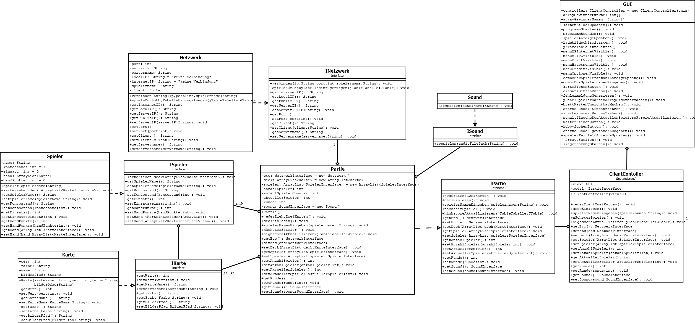

# 17 und 4 - Blackjack
WIT2B - No.3: 17 und 4  - Blackjack (12.05.2020 - 23.06.2020) 

Das Spiel, 17 und 4 bzw. Blackjack ist ein Projekt, welches wir am 12. Juni starteten und am 23. Juni 2020 vollenden. Am Ende sollen wir vor unserer Klasse, unser Programm in Form, eines Kundenvortrages vorstellen. Jedes Team bestand dabei aus drei Mitgliedern und wurde mit dem Kundenauftrag, „homeschooling_WIT2_ProjektBeschreibung_Black_Jack.pdf“ ins Projekt geschickt.

# Objektdiagramm

# Klassendiagramm

# Quellen:
Spielregeln: https://www.grandcasino-bern.ch/grand-casino-bern/media/gcb.content.pdfs/Spielanleitungen/Black_Jack/GrundbegriffeBackJack.pdf
